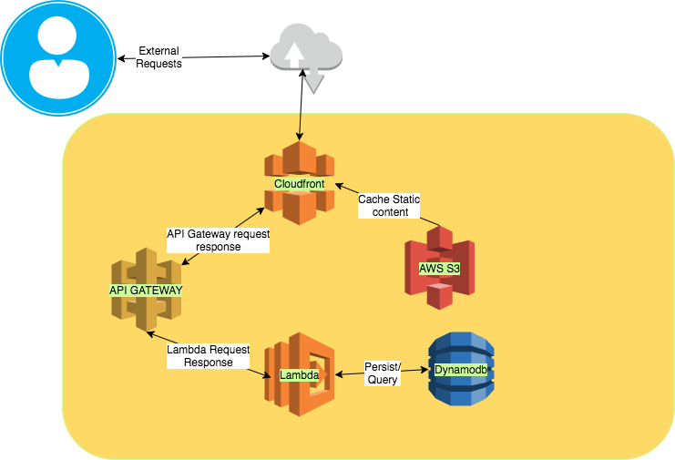

# Introduction
A popular streaming service has removed their five-star rating system for a thumbs up, thumbs down rating system.  You have been tasked with creating a web site that allows users to give a thumbs up or thumbs down for content displayed on the site.  Once a user selects a thumbs up or thumbs down the site will show how many users have made the same selection.   

# Constraints
   * You must have a full stack application with a frontend and a java backend.
   * The UI will allow a user to press thumb up or down for a movie or TV show. When the thumbs up or down is pressed, the site will display how many other users have done the same.  
   * The java backend will serve up the sample data below.  The java backend should also track how many users have given a thumbs up or down for each movie or TV show.
   * Your application must be hosted in AWS.  Please make use of free-tier services.
   * Your deployments to AWS must be automated.
   * Both your code and deployment automation must be checked into a public GitHub repo.

## Sample payload
```
{
  "movies":[
    {
        "id":"Stranger Things",
        "description":"When a young boy disappears, his mother, a police chief, and his friends must confront terrifying forces in order to get him back.",
        "category":[
           "Popular",
           "Horor"
        ]
    },
        {
        "id":"Doctor Strange",
        "description":"After a neurosurgeon loses the use of this hangs he meets a mystical mentor who helps him harness magic to become the most powerful sorcerer on Earth.",
        "category":[
           "Action"
        ]
    },
        {
        "id":"Planet Earth",
        "description":"This landmark series transports nature lovers all over the earth.",
        "category":[
           "Documentary"
        ]
    }
    
  ],
  "tv":[
      {
        "id":"Flash",
        "description":"Zoom challenges Barry to a race, but the team suspects a trap and tries to talk Barry out of it.",
        "category":[
           "Action"
        ]
    },
        {
        "id":"Friends",
        "description":"This his sitcom follows the merry misadventures of six 20-somethings pals as they naviagte the pitfalls of work, life and love.",
        "category":[
           "Comedy"
        ]
    },
        {
        "id":"Blue Bloods",
        "description":"New evidence surfaces against Danny in his shooting of a serial killer.",
        "category":[
           "Drama"
        ]
    }
    
  ]
}
 
```
# Approach 
I have taken a serverless implementation approach. The compomnents are modular in nature so that we can isolate issues more effectively. I have taken a design first approach where swagger document dictates the behavior of the application.
Please note that there are more endpoints defined that used in this project.

# Architecture



## Components

   * Cloudfront along with S3 is used to distribute and serve content.
   * AWS API gateway is used to federate requests and proxy requests to Lambda
   * AWS lambda provides the logic, compute and memory needs to process data
   * AWS Dynamodb is used to persist data regardgin media and votes

# Swagger design
```
swagger: "2.0"
info:
  description: "TV and Movie APIs Voting System"
  version: "1.0.0"
  title: "Voting System for TV and Movies"
  contact:
    email: "chandrashekar_tippur@intuit.com"
  license:
    name: "Apache 2.0"
    url: "http://www.apache.org/licenses/LICENSE-2.0.html"
basePath: "/current"
tags:
- name: "User"
  description: "User voting"
- name: "Vote"
  description: "Vote can be either up or down"
- name: "Medium"
  description: "Medium can be an array of tv or movie"
- name: "Media"
  description: "Details of each media"

schemes:
- "http"
paths:
  /media:
    post:
      tags:
      - "tv"
      - "movie"
      summary: "Add a new media"
      description: "Post call to add a new media"
      consumes:
      - "application/json"
      produces:
      - "application/json"
      parameters:
      - in: "body"
        name: "media"
        description: "Add medium"
        schema:
          $ref: "#/definitions/medium"
      responses:
        400:
          description: "Invalid input"
          
    get:
      description: "Get all media"
      responses:
        400:
          description: "Invalid input"
          
  /media/{media_type}:
    get:
      description: "Get all media of type tv or movie"
      parameters:
      - in: "path"
        name: "media_type"
        required: true
        type: "string"
        enum:
        - "tv"
        - "movies"

      responses:
        400:
          description: "Invalid input"
        200:
          description: "Successful response"

    
  /user:
    post:
      description: "Add a new user"
      consumes:
      - "application/json"
      produces:
      - "application/json"
      parameters:
      - in: "body"
        name: "user"
        description: "Add user"
        schema:
          $ref: "#/definitions/user"
      responses:
        400:
          description: "Invalid input"
      
  /vote:
    post: 
      description: "Post call to add a vote"
      consumes:
      - "application/json"
      produces:
      - "application/json"
      parameters:
      - in: "body"
        name: "media"
        description: "Add media"
        schema:
          $ref: "#/definitions/vote"
      responses:
        400:
          description: "Invalid input"
  
  /vote/{id}:  
    get:
      description: "Get votes for all "
      parameters:
      - in: "path"
        name: "id"
        required: true
        type: "string"
      responses:
        400:
          description: "Invalid input"
        200:
          description: "Successful response"
    

definitions:
  vote:
    type: "object"
    required:
    - "user_id"
    - "vote"
    - "media_id"
    properties:
      user_id:
         type: "string"
      vote:
         type: "string"
         enum: ["up", "down"]
      media_id:
        type: "number"
        
  medium:
    type: array
    items:
      $ref: "#/definitions/media"
  
  media:
    type: object
    properties:
      id:
        type: "string"
      description:
        type: "string"
      category:
        $ref: '#/definitions/category'

  category:
    type: "string"
    enum: ["Action", "Popular", "Horror", "Documentary", "Comedy", "Drama"]
  
  user:
    type: object
    properties:
      id:
        type: "string"
      first_name:
        type: "string"
      last_name:
        type: "string"
```

# Assumptions
   * User sessionbs are not maintained
   * A single user can vote multiple times for the same item. There is provision in the object model to account for this but due to time constraints, it could not be implemented.
   * Due to time constraints, implemented basic testing framewor.

# Testing
| Scenario | Testing status |
| Empty media | Yes  |
| Adding new media | Yes |
| Add new vote to a media that has not been voted on | Yes |
| Add vote to an exinsting media | Yes |

# Deployment
Deployment is broken into 2 parts due to time constraints:
   1. Deploying S3, and dynamodb resources are handled via terraform
      * Checkout code
      * cd terraform/environments/learning
      * terraform init
      * terraform get
      * terraform apply

Please ensure that the bucket and region are specified properly.
   2. Deploying Lambda code and api gateway resources are done via cloudformation templates
      * Checkout code
      * cd ```<root folder>```/ 
      * sh build.sh

